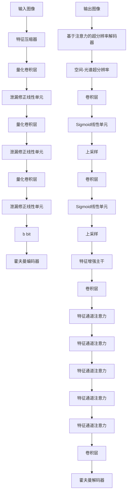

---
categories:
- 技能分享
date: 2025-06-10 10:14:29
title: 图表生成数据（Chart2data）实验——对比ChartVLM和Qwen-Omni
img: https://myblog-1257298572.cos.ap-shanghai.myqcloud.com/images/d969c3b0_1749549251583-7654c91e-ef01-4bf7-9656-11efa4778806.png
---

## **ChartVLM**

ChartVLM由两部分组成：图表结构解码器+大语言模型

截取了ChartVLM中的第一部分图表结构解码器，它的原生模型是pix2struct

显存占用基本保持在2506 MiB

### 普通图表

| 原图 | 识别结果 | 评价 |
|------|----------|------|
|  | **CSV数据：**<br/>Category,Percentage<br/>Visual Arts,25%<br/>Music,20%<br/>Theatre,15%<br/>Dance,15%<br/>Literature,5%<br/>Film,5%<br/><br/>**标题：** Distribution of Arts Categories in the USA in 2023<br/>**类型：** pie_chart | Theatre识别错了，识别成15%，实际为20%✅ |
|  | **CSV数据：**<br/>Month,Facebook User(million),Twitter User(million)<br/>January,2.2,2.0<br/>February,3.0,1.0<br/>March,4.0,2.0<br/>April,5.0,2.0<br/>May,6.0,3.0<br/>June,6.0,4.0<br/>July,7.0,4.0<br/>August,8.0,5.0<br/>September,9.0,5.0<br/>October,9.0,6.0<br/><br/>**标题：** Growth of Social Media Users in 2020<br/>**类型：** line_chart_num | 2个数据识别错误，January-Facebook识别成了2.2，应该是2✅ |
|  | **CSV数据：**<br/>Characteristic,ChartX-Redrawing,ChartX-Description<br/>Chart-to-Text,17.18,15.5<br/>OpenCQA,20.39,15.5<br/>Chart-to-Table,93.78,91.6<br/>ChartX-QA,33.35,17.19<br/>ChartX-Summary,13.35,13.8<br/>ChartInstruct-7B,7.78,7.16<br/>ChartLama-13B,66.64,69.66<br/>ChartAst-13B,55.32,56.64<br/>TinyChart-3B,38.0,38.0<br/><br/>**标题：** ChartQA<br/>**类型：** heatmap | 完全没有识别出来❌ |
|  | **CSV数据：**<br/>Characteristic,194 it/s<br/>ChartLama-13B,1.47<br/>TinyChart-3B,3.14<br/>ChartAst-13B,1.47<br/><br/>**标题：** ChartLlama - 13B<br/>**类型：** heatmap | 图表类型、标题识别错误，数据也不准确❌ |
|  | **CSV数据：**<br/>Characteristic,ChartX-Redrawing,OpenCQA,ChartX-Table<br/>ChartX-QA,93.78,91.6,7.16<br/>ChartX-QA,33.35,17.19,13.8<br/>ChartLama-13B,30.99,13.35,10.4<br/>ChartAst-13B,147.17,138.0,9.82<br/>TinyChart-3B,1.94,1.47,6.64<br/><br/>**标题：** ChartQA<br/>**类型：** radar | 没有识别多子图的能力❌ |
|  | 这张图尺寸大，显存占用达到了8754 MiB<br/><br/>**部分CSV数据：**<br/>Characteristic,2020-16 GDP,2021-17 GDP<br/>7-8,110000,124000<br/>9-10,103000,116000<br/>11-12,102000,117000<br/>...(数据过长，已截取)<br/><br/>**标题：** 近两年全面多个总价的GDP<br/>**类型：** bar_chart | 中文不支持，数据基本识别出来，数据识别的还可以 |

### 流程图

| 原图 | 识别结果 | 评价 |
|------|----------|------|
|  | **CSV数据：**<br/>Characteristic,12k to 14k,15k to 19k,20k to 24k,25k to 34k,35k to 44k,45k to 54k,55k to 64k<br/>Lightweight Quantized Neural Encoder,125.5,135.5,150.5,172.5,190.5,175.5,185.5<br/>...(其他数据)<br/><br/>**标题：** Super-resolution decoder<br/>**类型：** candlestick | 流程图也是没法识别的❌ |

### ChartVLM支持的图表类型


## **Qwen2.5-Omni-7B**

### 普通图表

| 原图 | echarts重建效果 | python code重建效果 |
|------|----------------|-------------------|
|  |  | <br/>matplotlib库 |
|  |  |  |
|  |  | 跑不出来 |
|  |  |  |
|  | <br/><br/>通过prompt提示可以识别出多子图，并且重建效果跟上面两个一样 | <br/> |
|  |  | <br/>中文显示不出来是因为我的电脑没安装字体，源码中是有的 |

### 流程图

| 原图 | mermaid重建效果 |
|------||------|
|  |  |

## **echarts**

一种声明式的可视化语言，语法结构类似于json和python dict

与echarts相似的产品还有vega-lite，不过流行度不高，大模型的理解差，解析效果差，不如echarts

```javascript
option = {
    title: {
        text: 'Distribution of Arts Categories in the USA in 2023',
        left: 'center'
    },
    tooltip: {},
    legend: {
        data: ['Visual Arts', 'Music', 'Theatre', 'Dance', 'Literature', 'Film']
    },
    series: [{
        name: 'Arts Categories',
        type: 'pie',
        radius: '50%',
        data: [
            {value: 25, name: 'Visual Arts'},
            {value: 20, name: 'Music'},
            {value: 20, name: 'Theatre'},
            {value: 15, name: 'Dance'},
            {value: 15, name: 'Literature'},
            {value: 5, name: 'Film'}
        ],
        emphasis: {
            itemStyle: {
                shadowBlur: 10,
                shadowOffsetX: 0,
                shadowColor: 'rgba(0, 0, 0, 0.5)'
            }
        }
    }]
};
```

## **python code**

生成语法是基于matplotlib库的，这是一个面向过程的语言，类似于海龟画图，除了数据之外，还有很多绘图过程

```python
import matplotlib.pyplot as plt
import numpy as np

# 数据
categories = ['ChartX-QA', 'Chart-to-Text', 'OpenCQA', 'Chart-to-Table', 'ChartX-Redrawing', 'ChartX-Description', 'ChartX-Summary']
values_Llava1_5_13B = [93.78, 17.18, 20.39, 30.99, 83.6, 1.89, 1.64]
values_ChartInstruct_7B = [91.6, 14.23, 115.59, 33.35, 79.9, 0.94, 0.33]
values_ChartLlama_13B = [7.16, 12.92, 7.16, 17.19, 69.66, 1.03, 1.04]
values_ChartAst_13B = [14.23, 12.92, 7.16, 17.19, 69.66, 1.03, 1.04]
values_TinyChart_3B = [17.18, 14.23, 20.39, 30.99, 83.6, 1.89, 1.64]

# 设置颜色
colors = ['blue', 'green', 'orange', 'red', 'cyan']

# 创建雷达图
fig, ax = plt.subplots(subplot_kw={'projection': 'polar'})

# 绘制每种模型的数据
for i, values in enumerate([values_Llava1_5_13B, values_ChartInstruct_7B, values_ChartLlama_13B, values_ChartAst_13B, values_TinyChart_3B]):
    ax.plot(categories, values, color=colors[i], linewidth=2)
    ax.fill(categories, values, alpha=0.25, color=colors[i])

# 设置标签
ax.set_rlabel_position(-22.5)
ax.set_xticks(np.arange(len(categories)) * np.pi / len(categories) - np.pi / 2)
ax.set_xticklabels(categories)
ax.set_yticks([0, 10, 20, 30, 40, 50, 60, 70, 80, 90])
ax.set_ylim(0, 100)

# 添加图例
ax.legend(loc='upper center', bbox_to_anchor=(0.5, -0.1), ncol=5)

plt.show()
```

## **mermaid**

也是一种声明式的流程图语言，用的蛮多的，qwen和豆包的前端都支持渲染mermaid，所以在线大模型对mermaid的理解肯定也不差



## **总结**

**ChartVLM**
- 优点：体量小2506 MiB就能跑
- 缺点：只支持简单的基本图表类型，解析效果差

**Qwen2.5-Omni-7B**
- 优点：啥都能解析，效果好
- 缺点：体量大，需大半张卡